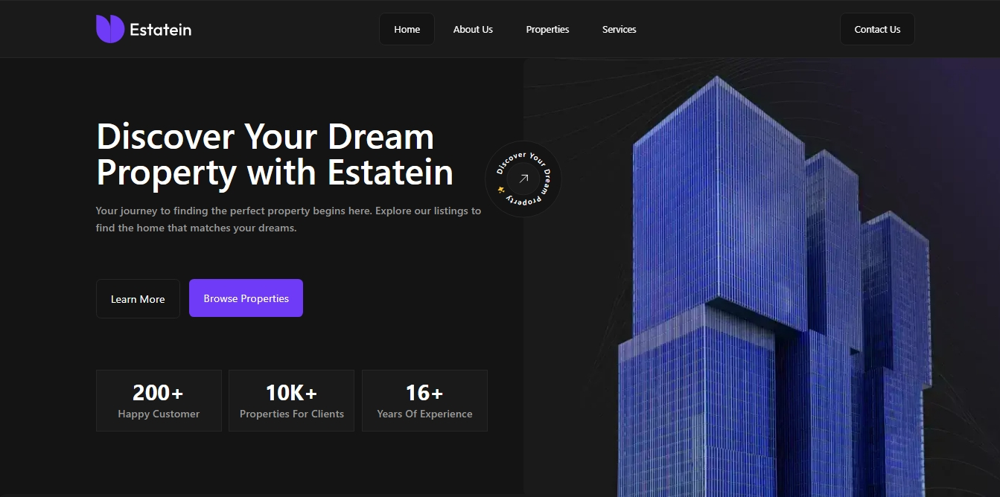

<div align="center">
  
  <p>Estatein</p>
</div>

# Estatein

A website for the real estate company Estatein. Featuring information about it like there journey, achievements, clients and more and there properties.



[Design on figma](https://www.figma.com/community/file/1314076616839640516) by [Produce-ui](https:///produce-ui.com)

## Built With

- [React](https://reactjs.org/)
- [TypeScript](https://www.typescriptlang.org/)
- [Vite](https://vitejs.dev/)
- [React Router](https://reactrouter.com/)
- [Tailwind CSS](https://tailwindcss.com/)
- [Tanstack Query (React Query)](https://tanstack.com/query/latest)
- [Axios](https://axios-http.com/docs/intro)
- [React Hook Form](https://react-hook-form.com/)
- [Zod](https://zod.dev/)
- [Shadcn ui](https://ui.shadcn.com/)

## API

This project uses [Estatein Backend API](https://github.com/Abdalrhman-Almarakeby/estatein-backend) for:

- Getting properties data.
- Subscribing to the news letter.
- Sending inquires.

For more information check out [Estatein Backend API](https://github.com/Abdalrhman-Almarakeby/estatein-backend)

## Live Demo

You can view a live demo hosted on [Vercel](https://vercel.com/):

https://estatein--app.vercel.app

**Note**: The backend API is hosted on [Render](https://render.com/) on the free instance, The service is great but unfortunately it spin down with inactivity, which can delay the first request. Sorry for that 😔.

## Running Locally

1.  Clone the repository:

```
git clone https://github.com/Abdalrhman-Almarakeby/estatein-frontend.git
```

2.  Navigate to the project directory:

```
cd estatein-frontend
```

3.  Install dependencies:

```
npm install
```

4.  Start the local development server:

```
npm run dev
```

5.  Open [http://localhost:3000](http://localhost:3000/) in your browser.

## Contact

Github: [Abdalrhman Almarakeby](https://github.com/Abdalrhman-Almarakeby)

Linkedin :[Abdalrhman Almarakeby](https://www.linkedin.com/in/abdalrhman-almarakeby/)

Email: almarakeby.work@gmail.com
